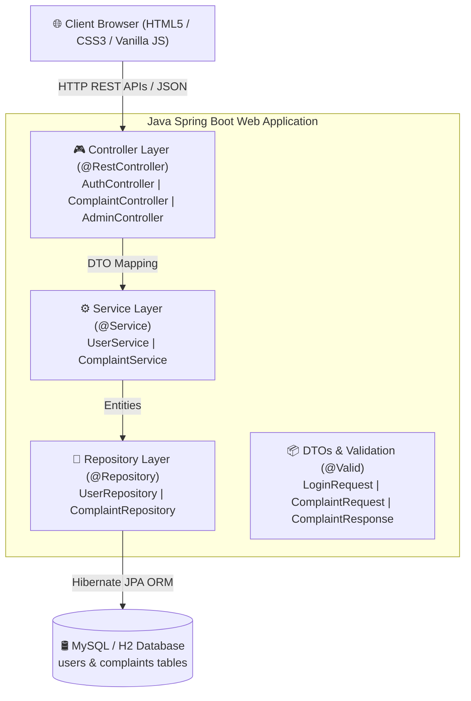

# Smart Complaint & Service Management System

[](https://smart-complaint-management.onrender.com)
[](https://www.oracle.com/java/)
[](https://spring.io/projects/spring-boot)

A production-ready, full-stack **Smart Complaint & Service Management System** built with **Java 17+, Spring Boot 3, Spring Data JPA, MySQL / H2**, and **Vanilla HTML5/CSS3/JavaScript**.

This project is tailored specifically for **B.Tech placement interviews (e.g., TCS, TCS Prime, Infosys, Wipro)** to demonstrate a clean, understandable, layered Java enterprise architecture with real-world business rules.

---

## 🏗️ 1. Architecture Diagram



---

## 📝 2. Project Overview & Problem Statement

### Problem Statement
In educational campuses, hostels, and corporate facilities, maintenance issues (such as broken Wi-Fi, plumbing leaks, electrical faults, and broken furniture) are often reported informally via calls or physical registers. This leads to untracked complaints, delayed resolutions, lack of technician accountability, and frustration among residents.

### Solution Overview
The **Smart Complaint & Service Management System** centralizes service requests into a web portal where:
- **Students / Users** can quickly lodge complaints with category, priority, and description, and visually track resolution progress from `OPEN` to `CLOSED`.
- **Administrators / Maintenance Teams** gain a real-time analytics dashboard to monitor open tickets, assign staff technicians, change status transitions, update priorities, and generate metrics.

---

## ✨ 3. Key Features

### User Capabilities
- **Account Registration & Authentication**: Secure sign-up & login with BCrypt password hashing.
- **Raise Complaint**: Submit requests with specific categories (*Internet, Electrical, Plumbing, Cleaning, Furniture, Other*), priority (*LOW, MEDIUM, HIGH*), and description.
- **Live Visual Status Tracker**: Interactive status stepper (`OPEN → ASSIGNED → IN_PROGRESS → RESOLVED → CLOSED`).
- **Personal Dashboard**: Track complaint metrics and history.

### Admin Capabilities
- **Management Dashboard**: Real-time summary cards for Total, Open, In Progress, Resolved, Closed, and High Priority complaints.
- **Search & Multi-field Filtering**: Instant search by ID/Keyword and filtering by Status, Priority, and Category.
- **Technician Assignment**: Assign specific staff (e.g., *"Ramesh Electrician"*) to complaints (automatically updating state to `ASSIGNED`).
- **Controlled Status Transitions**: Enforces business state-machine rules (prevents invalid transitions such as `CLOSED → IN_PROGRESS`).
- **Priority Override**: Escalate or adjust ticket priority on demand.

---

## 🛠️ 4. Technology Stack

| Component | Technology | Description |
| :--- | :--- | :--- |
| **Backend Framework** | Java 17+ / Spring Boot 3 | REST API development, Dependency Injection |
| **Persistence** | Spring Data JPA / Hibernate | Object-Relational Mapping (ORM) & Derived Queries |
| **Validation** | Jakarta Bean Validation | `@NotBlank`, `@Email`, `@Pattern`, `@Size` |
| **Security/Crypto** | Spring Security Crypto | `BCryptPasswordEncoder` for password security |
| **Database** | MySQL 8.x / H2 | Relational database storage |
| **Frontend** | HTML5, CSS3, Vanilla JavaScript | Responsive UI using standard `fetch()` API |
| **Build Tool** | Apache Maven | Project build and dependency management |
| **Testing** | JUnit 5 & Mockito | Unit tests for service layer & validation logic |

---

## 🛢️ 5. Database Schema & Entity Relationship

```
+-----------------------------------+          +-----------------------------------+
|               users               |          |            complaints             |
+-----------------------------------+          +-----------------------------------+
| id          : BIGINT (PK, AI)     | 1      * | id          : BIGINT (PK, AI)     |
| name        : VARCHAR(100)        |<-------->| user_id     : BIGINT (FK -> users)|
| email       : VARCHAR(100) UNIQUE |          | category    : VARCHAR(50)       |
| password    : VARCHAR(255)        |          | description : TEXT              |
| role        : VARCHAR(20)         |          | priority    : VARCHAR(20)       |
+-----------------------------------+          | status      : VARCHAR(30)       |
                                               | assigned_to : VARCHAR(100)      |
                                               | created_at  : DATETIME          |
                                               | updated_at  : DATETIME          |
                                               +-----------------------------------+
```

---

## 🚀 6. REST API Documentation

### Authentication APIs (`/api/auth`)

| Method | Endpoint | Request Body | Description |
| :--- | :--- | :--- | :--- |
| `POST` | `/api/auth/register` | `{ name, email, password, role }` | Registers new user (`USER` or `ADMIN`). |
| `POST` | `/api/auth/login` | `{ email, password }` | Authenticates user & returns user info. |

### Complaint APIs (`/api/complaints`)

| Method | Endpoint | Request Body / Query | Description |
| :--- | :--- | :--- | :--- |
| `POST` | `/api/complaints` | `{ userId, category, description, priority }` | Creates a new complaint (`OPEN`). |
| `GET` | `/api/complaints?userId={id}` | Query Parameter: `userId` | Retrieves complaints for specific user. |
| `GET` | `/api/complaints/{id}` | Path Variable: `id` | Gets single complaint details by ID. |
| `DELETE` | `/api/complaints/{id}` | Path Variable: `id` | Deletes complaint record. |

### Admin Management APIs (`/api/admin`)

| Method | Endpoint | Request Payload / Query | Description |
| :--- | :--- | :--- | :--- |
| `GET` | `/api/admin/dashboard` | None | Returns summary metrics for admin cards. |
| `GET` | `/api/admin/complaints` | Filters: `status`, `priority`, `category`, `search` | Search & filter all complaints. |
| `PUT` | `/api/admin/complaints/{id}/status` | `{ "status": "IN_PROGRESS" }` | Updates status following transition rules. |
| `PUT` | `/api/admin/complaints/{id}/priority` | `{ "priority": "HIGH" }` | Updates complaint priority level. |
| `PUT` | `/api/admin/complaints/{id}/assign` | `{ "assignedTo": "Ramesh Staff" }` | Assigns technician to complaint. |

---

## ⚙️ 7. Setup & MySQL Configuration

### Step 1: Clone or Navigate to Project Directory
```bash
cd smart-complaint-management
```

### Step 2: Configure Database
Runs automatically out-of-the-box using H2 In-Memory Database.
To use MySQL, create database:
```sql
CREATE DATABASE smart_complaint_db;
```

And update `src/main/resources/application.properties`:
```properties
spring.datasource.url=jdbc:mysql://localhost:3306/smart_complaint_db
spring.datasource.username=root
spring.datasource.password=YOUR_MYSQL_PASSWORD
```

### Step 3: Build & Run Application
```bash
java -jar target/smart-complaint-management-1.0.0.jar
```

Once started, open browser at: **`http://localhost:8080`**

---

## 🔑 8. Sample Demo Credentials

- **Admin Account**: `admin@service.com` / `admin123`
- **Student User Account**: `student@service.com` / `student123`

---

## 🔮 9. Future Production Improvements
1. **JWT Authentication**: Introduce JSON Web Tokens (JWT) with Spring Security filters.
2. **Notification System**: Integration with Email/SMS gateway (Twilio/SendGrid) on status updates.
3. **File Attachments**: Allow users to upload photos of broken equipment via Amazon S3 / MultipartFile storage.
4. **Service Level Agreement (SLA) Escalation**: Auto-escalate complaints if pending past SLA threshold (e.g. HIGH priority unresolved for 24h).
